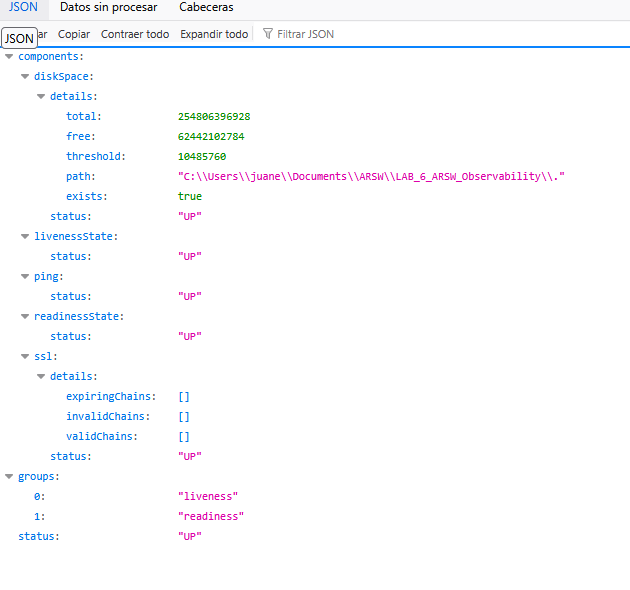
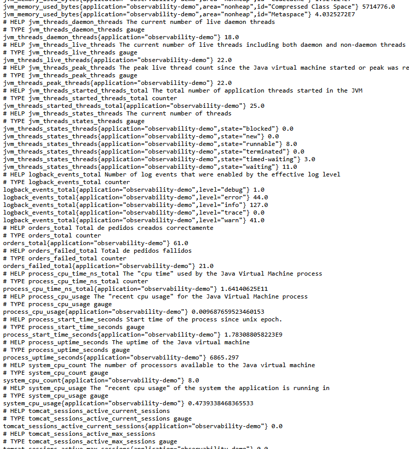
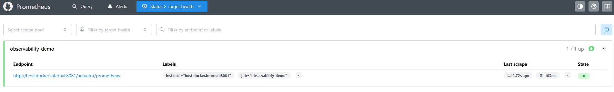
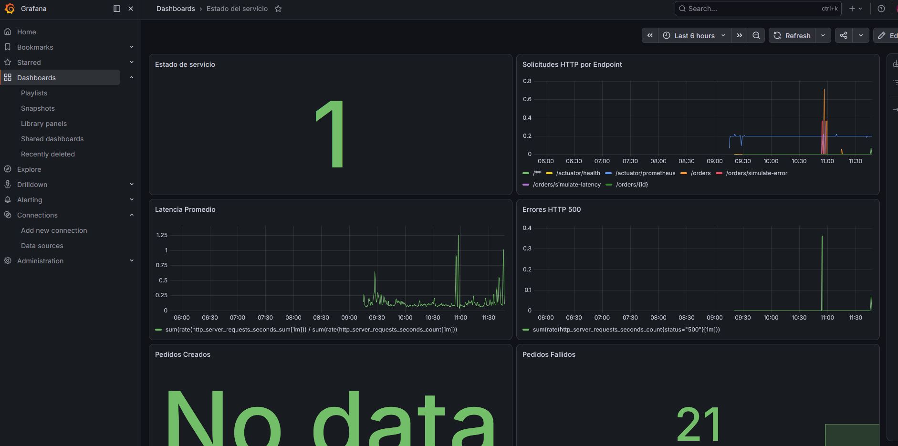

# ARSW Microservices Observability Lab 6 - Juan Esteban Rodríguez

---

## Project Description

This project implements a complete observability environment for a Spring Boot microservice using modern observability tools and practices. The application exposes metrics, logs, and monitoring capabilities to analyze system behavior, detect incidents, and evaluate application performance.

The observability stack includes:

- **Spring Boot Actuator**
- **Micrometer**
- **Prometheus**
- **Grafana**
- **Loki**
- **Promtail**
- **Docker Compose**

The laboratory demonstrates how metrics, logs, and monitoring dashboards can be used together to diagnose failures, analyze latency, and monitor business and technical indicators.

---


## Technologies Used

- Java 17
- Spring Boot 3
- Spring Boot Actuator
- Micrometer
- Prometheus
- Grafana
- Loki
- Promtail
- Docker Compose
- Maven

---


## Features Implemented

### Business Endpoints

| Endpoint | Method | Description |
|----------|---------|-------------|
| `/orders` | POST | Creates a new order |
| `/orders/{id}` | GET | Retrieves an order |
| `/orders/simulate-latency` | GET | Simulates response latency |
| `/orders/simulate-error` | GET | Simulates internal server errors |

---

### Actuator Endpoints

| Endpoint | Description |
|-----------|-------------|
| `/actuator/health` | Application health status |
| `/actuator/info` | Application information |
| `/actuator/metrics` | Available metrics |
| `/actuator/prometheus` | Prometheus metrics endpoint |

---

## Custom Metrics

The application exposes custom business metrics:

### Orders Created

```text
orders_created_total
```

Tracks the total number of successfully created orders.

### Orders Failed

```text
orders_failed_total
```

Tracks the total number of failed orders.

---

## Running the Application

### Clone the repository

```bash
git clone <repository-url>
cd LAB_6_ARSW_Observability
```

### Run the Spring Boot application

```bash
mvn clean install
mvn spring-boot:run
```

Application URL:

```text
http://localhost:8081
```




---


## Running the Observability Stack

Start the monitoring environment:

```bash
docker compose up -d
```

Verify running containers:

```bash
docker ps
```

Expected containers:

- arsw-prometheus
- arsw-grafana
- arsw-loki
- arsw-promtail

---

## Access URLs

| Service | URL |
|---------|-----|
| Spring Boot | http://localhost:8081 |
| Prometheus | http://localhost:9090 |
| Grafana | http://localhost:3000 |
| Loki | http://localhost:3100 |





---

## Grafana Credentials

```text
Username: admin
Password: admin
```

---

## Dashboard

The dashboard includes the following panels:

- Service Availability
- HTTP Requests per Endpoint
- Average Latency
- HTTP 500 Errors
- Orders Created
- Orders Failed
- JVM Memory Usage
- Process CPU Usage

---

## Incident Simulation

### Error Simulation

```bash
curl http://localhost:8081/orders/simulate-error
```

Observed metrics:

- HTTP 500 errors
- orders_failed_total
- ERROR logs

---

### Latency Simulation

```bash
curl http://localhost:8081/orders/simulate-latency
```

Observed metrics:

- Increased response time
- WARN logs
- Average latency panel

---

### Order Creation Simulation

```bash
curl -X POST http://localhost:8081/orders \
-H "Content-Type: application/json" \
-d '{"customerId":"CUS-01","total":120000}'
```

Observed metrics:

- HTTP requests
- orders_created_total
- Business logs

---

## Monitoring Queries

### Service Status

```promql
up{job="observability-demo"}
```

### HTTP Requests

```promql
sum by (uri,method,status)
(rate(http_server_requests_seconds_count[1m]))
```

### Average Latency

```promql
sum(rate(http_server_requests_seconds_sum[1m]))
/
sum(rate(http_server_requests_seconds_count[1m]))
```

### HTTP 500 Errors

```promql
sum(rate(http_server_requests_seconds_count{status="500"}[1m]))
```

### Orders Created

```promql
orders_created_total
```

### Orders Failed

```promql
orders_failed_total
```

---

## Proposed Alerts

### Service Down

```promql
up{job="observability-demo"} == 0
```

### Internal Server Errors

```promql
sum(rate(http_server_requests_seconds_count{status="500"}[1m])) > 0
```

### High Latency

```promql
(
sum(rate(http_server_requests_seconds_sum[1m]))
/
sum(rate(http_server_requests_seconds_count[1m]))
) > 1
```

---

## Observability Analysis

This project demonstrates the importance of combining:

- **Metrics** for quantitative monitoring.
- **Logs** for event analysis.
- **Dashboards** for visualization.
- **Alerts** for proactive detection.
- **Distributed tracing concepts** for future scalability.

Observability allows teams to answer critical questions such as:

- Is the service available?
- Which endpoint is failing?
- Where did latency increase?
- Which logs explain the failure?
- Which metric confirms the incident?
- Which action should be taken?

---

## Conclusions

This laboratory provides a practical implementation of observability in a microservices environment. By integrating Prometheus, Grafana, Loki, and Spring Boot Actuator, it is possible to monitor application health, analyze incidents, detect performance degradation, and support operational decision-making through data-driven insights.

---
